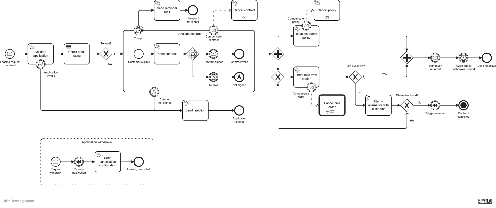

# Camunda 8 Bike-Leasing Blueprint

> [!NOTE]
> **🚧 Work in progress.** This is a **solution template** — a reference to fork and build on, for
> our consultants and anyone else — not a product that ships. It's still being fleshed out, so parts
> may be incomplete and it may not yet fully demonstrate what it's meant to. Treat it as a
> living example, and expect it to keep evolving.

A ready-to-fork **starting point** for automating a business process on
[Camunda 8](https://camunda.com) (Zeebe, self-managed) with Spring Boot and Kotlin — one complete,
runnable, production-shaped BPMN service you can clone and make your own.

It targets an **external Zeebe broker**: each BPMN service task is handled by a Spring **job worker**
rather than an in-process engine, wrapped in clean hexagonal engineering scaffolding.

## The scenario

Meet **MiraVelo** — a (fictional) lifestyle bike brand for the quarter-life-crisis crowd: gravel bikes
for the weekends that count, road bikes for everyone who just wants to feel the asphalt. MiraVelo sells
its bikes on a **leasing model** for private and corporate customers, and this project automates that
leasing application from the first request to an active lease.

It's a made-up company, so nobody gets hurt when the DMN politely declines a 15-year-old's application
for a carbon road bike.

## What's inside

Most engine examples stop at a happy-path service task. This one deliberately walks through the **broad
palette of BPMN elements you actually meet in real processes** — and the engineering scaffolding around
them — so a new project starts from something complete instead of a blank page:



- a **message start event**, **service tasks** (job workers) and a **DMN business-rule task**;
- an **embedded sub-process** with an **event-based gateway** (sign vs. a 14-day deadline) and a
  non-interrupting **7-day reminder timer**;
- a **parallel fork/join**, and a **user task with a Camunda Form** — completable in the Tasklist *or*
  via a REST endpoint;
- **compensation / SAGA** handlers guarded by **error** and **escalation** boundary events;
- a **call activity** into a second process, a **message event sub-process** (application withdrawal),
  and a **terminate end event**.

## How it's built

```
service/
  common-architecture-tests/   reusable ArchUnit + Konsist rule suite (src/main)
  common-zeebe/                Zeebe glue: ProcessEngineApi, BPMN auto-deploy, connection config
  common-zeebe-test/           camunda-process-test helpers (assertions, test engine wiring)
  app/                         the Camunda 8 bike-leasing service (hexagonal)
    adapter/inbound/rest        domain REST controllers
    adapter/inbound/zeebe       @JobWorker handlers for the BPMN service tasks
    adapter/outbound/zeebe      drives the engine (ProcessEngineApi / CamundaClient)
    adapter/outbound/db         JPA persistence (leasing applications + bike portfolio)
    adapter/outbound/dealer     simulated bike dealer (stock check + order)
    adapter/process             generated *ProcessApi (bpmn-to-code) constants
    application/{port,service}  use-case ports and their services
    domain/{leasing,bike}       pure domain model
    resources/{bpmn,dmn,forms}  the process models and Camunda Forms
bruno/                         REST scenarios (happy-path / abort / not-solvent / bike-unavailable)
tools/                         BPMN linting (bpmnlint)
stack/                         Camunda 8 self-managed dev stack (docker compose)
.github/                       pre-merge pipeline + Dependabot
```

- **Stack:** Kotlin · Spring Boot 4 · **Camunda 8.9 (Zeebe, self-managed)** · PostgreSQL ·
  Elasticsearch · Gradle with a `libs.versions.toml` version catalog.
- **Reusable Zeebe glue:** the `:service:common-zeebe` module contributes the `CamundaClient`
  connection (self-managed, auth off for local dev), a small `ProcessEngineApi` (start instance /
  publish message), and classpath **auto-deployment** of every `.bpmn`, `.dmn` and `.form` on startup —
  any service that depends on it gets a working Zeebe integration for free.
- **Generated process API:** the [`bpmn-to-code`](https://github.com/emaarco/bpmn-to-code) Gradle
  plugin turns each `.bpmn` into a typed `*ProcessApi` object, so element ids, messages, job types,
  timers and variables are compile-checked constants used by both workers and tests.
- **Forms:** Camunda 8 Forms (`.form`) are deployed with the process and render in the Tasklist for the
  user tasks.
- **BPMN linting:** [`bpmnlint`](https://github.com/bpmn-io/bpmnlint) (`bpmnlint:recommended`) gates the
  `.bpmn` models in `tools/`, run in CI before the Gradle build.

## Design decisions

- **Hexagonal architecture** keeps the engine and framework at the edges: the domain and use cases
  never depend on Zeebe, so business logic is testable and the engine is replaceable. The
  `:service:common-architecture-tests` module enforces this with **ArchUnit** (bytecode: layering,
  dependency direction, naming) and **Konsist** (source: one declaration per file, no wildcard
  imports) — one line wires it into a service: `class ArchitectureTest : ServiceArchitectureTest(...)`.
- **No business key.** Zeebe has no process business key, so the leasing **`applicationId` travels as a
  process variable** and is declared as the **message subscription correlation key** on every catch
  event. Messages are published with that id as their correlation key, and the alternative-clarification
  user task is completed by an element-id + `applicationId` lookup (see `LeasingProcessAdapter`).
- **Job workers, not delegates.** Each BPMN service task is a Spring `@JobWorker` in
  `adapter/inbound/zeebe`; `validateApplication` raises the `applicationInvalid` BPMN error through the
  job client so the error boundary event catches it. Workers hold no business logic — they call use cases.
- **Unit tests** (JUnit 5 + MockK) cover every domain type, application service, adapter and worker with
  given/when/then comments and shared `testLeasingApplication(...)` builders — controllers via
  `@WebMvcTest`, persistence via `@DataJpaTest`.
- **Process tests** (`camunda-process-test`) drive the deployed model on a real (in-container) Camunda 8
  engine: workers auto-register, timers are advanced with `increaseTime`, messages are published through
  the real adapter — covering happy-path, escalation, DMN rejection, withdrawal → SAGA compensation, and
  the bike-unavailable → alternative-selection loop.
- **Model validation** (`bpmn-to-code-testing`) checks the `.bpmn` models structurally at build time for
  engine `ZEEBE` (`BpmnRules.all()`).
- **Bruno + CI** proves the REST-drivable scenarios against the *running* app: domain REST endpoints
  drive the business actions and the Camunda 8 REST API completes the form-only user task. **Timer note:**
  a running Zeebe broker cannot fast-forward timers over REST, so the timer-gated finals (the 14-day
  withdrawal / signature deadline) are covered by the process tests rather than Bruno.
- **Dependabot** keeps Gradle, the compose images and GitHub Actions current.

## Run it

```bash
# 1. start the Camunda 8 stack (Zeebe + Operate/Tasklist + Postgres + Elasticsearch)
docker compose -f stack/docker-compose.yml up -d

# 2. run the app (REST API on http://localhost:8081)
./gradlew :service:app:bootRun

# 3. lint the BPMN models
npm --prefix tools ci && npm --prefix tools run lint:bpmn

# 4. build + run all tests (arch + unit + worker + model + process tests; needs Docker for the
#    in-container process-test engine)
./gradlew build

# 5. drive the REST scenarios against the running app
cd bruno && npx @usebruno/cli run . --env local -r
```

Operate and Tasklist are at `http://localhost:8080` (`demo` / `demo`). The Spring app runs on **8081**
because the Camunda web apps hold 8080.

Start a case with `POST http://localhost:8081/api/bike-leasing`
(`{ "customerName": …, "email": …, "age": 35, "monthlyNetIncome": 3500, "bikeId": "BIKE-900", "bikeModel": "Gravel Explorer 900" }`).

The `age` and `monthlyNetIncome` feed the `checkCreditRating` DMN; the `bikeId` identifies the bike and
is the *only* bike attribute the engine ever carries. The descriptive `bikeModel` lives in a separate
**bike portfolio** aggregate (its own `bike_portfolio` table, keyed by `bikeId`) — never as a process
variable — and `GET /api/bike-leasing/{id}` resolves it back from there.

If the requested bike is out of stock (`bikeId: "BIKE-OOS"`), the `Clarify alternative with customer`
user task can be resolved **two ways**, a deliberate contrast:

- the **recommended** path — a client calls `POST …/api/bike-leasing/{id}/clarify-alternative`, which
  routes through the domain (persisting the chosen alternative) *before* completing the task; versus
- the **form-only** path on `clarify-return` in `cancel-bike-order.bpmn`, kept as a counter-example:
  completing it via the Camunda Form or the Camunda 8 REST API never touches the domain, so its data
  lands only in process variables (see the `bpmn:documentation` on each task).

## Incident demo

Want to teach **transaction boundaries, retries and incidents**? Submit a request for the poison bike
`BIKE-FAIL`: the simulated dealer "outage" fails the *Order bike from dealer* job, its retries count
down (`retries="3"`, 10s apart), and once they hit 0 Zeebe raises an **incident** you can analyze and
retry in **Operate**. A ready-to-run Bruno collection lives in `bruno/06-incident-demo/`.

## Contributing

Contributions are welcome. Please open an issue to discuss substantial changes first, keep the
architecture tests green (`./gradlew build`), and use
[Conventional Commits](https://www.conventionalcommits.org) for commit messages and PR titles.

## License

Licensed under the [MIT License](./LICENSE).
