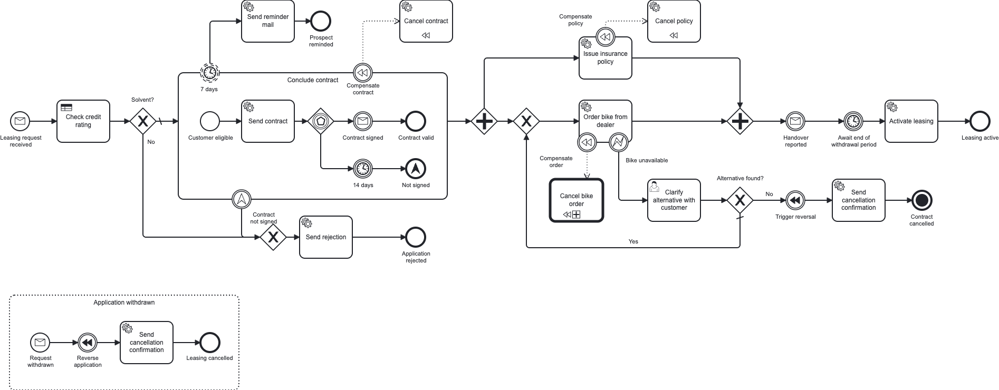

# Camunda 8 Bike-Leasing Blueprint

> [!NOTE]
> **🚧 Work in progress.** A **solution template** to fork and build on — not a product that ships.
> Expect it to keep evolving.

A ready-to-fork **starting point** for automating a business process on
[Camunda 8](https://camunda.com) (Zeebe, self-managed) with Spring Boot — one complete, runnable,
production-shaped BPMN service. It targets an **external Zeebe broker**: each BPMN service task is
handled by a Spring **job worker** rather than an in-process engine.

<!-- variant:blueprint -->
## 🧭 Pick your stack

| | [`kotlin-gradle/`](kotlin-gradle/README.md) | [`java-maven/`](java-maven/README.md) |
|---|---|---|
| **Stack** | Kotlin 2.4 · Gradle | Java 21 · Maven |
| **Choose it when** | you are free to choose — **our recommendation for a modern stack** | Java + Maven is your team's or company's standard, or you are in a training |

Both run the same process, expose the same REST contract and pass the same end-to-end scenarios. Each
directory is self-contained — build, code, process models and schema — and CI keeps the models and
configuration of the two identical, so only the language and the build tool differ. Building on one?
[Turn the repo into a single-stack starter](docs/starter.md) with one command.
<!-- /variant:blueprint -->

## 🚲 The scenario

**MiraVelo** is a (fictional) bike brand that sells on a **leasing model**. This service automates a
leasing application from the first request to an active lease — and deliberately walks through the
**broad palette of BPMN elements you meet in real processes**, not just a happy-path service task:



- **message start event**, **service tasks** (job workers) and a **DMN business-rule task**
- **embedded sub-process** with an **event-based gateway** and a non-interrupting **reminder timer**
- **parallel fork/join**, and a **user task with a Camunda Form** — completable in the Tasklist or via REST
- **compensation / SAGA** handlers guarded by **error** and **escalation** boundary events
- **call activity**, **message event sub-process** (withdrawal) and a **terminate end event**

## 🚀 Run it

You need **JDK 21** and **Docker** (or Podman).

**1. Start the Camunda 8 stack** (Zeebe, Operate, Tasklist, Elasticsearch) and Postgres

```bash
docker compose -f stack/docker-compose.yml up -d
```

**2. Start the service** on :8081

<!-- variant:kotlin-gradle -->
```bash
cd kotlin-gradle && ./gradlew :service:app:bootRun
```
<!-- /variant:kotlin-gradle -->
<!-- variant:blueprint -->
or
<!-- /variant:blueprint -->
<!-- variant:java-maven -->
```bash
cd java-maven && ./mvnw -pl service/app -am spring-boot:run
```
<!-- /variant:java-maven -->

**3. Use it** — open Operate / Tasklist at <http://localhost:8080> (demo/demo) or the Swagger UI at
<http://localhost:8081/swagger-ui.html>, or drive the whole process over REST:

```bash
cd bruno && npx --yes @usebruno/cli@4.0.0 run . --env local -r
```

## 📂 What's where

<!-- variant:kotlin-gradle variant:nested -->
- [`kotlin-gradle/`](kotlin-gradle/README.md) — the service in Kotlin + Gradle, its build and quality gates
  <!-- /variant:kotlin-gradle -->
  <!-- variant:java-maven variant:nested -->
- [`java-maven/`](java-maven/README.md) — the service in Java 21 + Maven, its build and quality gates
  <!-- /variant:java-maven -->
- [`openapi/`](openapi/openapi.json) — the checked-in, drift-gated OpenAPI contract
- [`bruno/`](bruno/README.md) — the REST scenarios, the two ways to complete a user task, the incident demo
- [`stack/`](stack/docker-compose.yml) — the Camunda 8 self-managed dev stack and Postgres
- [`docs/`](docs/README.md) — the Architecture Decision Records: why the repo is shaped this way
- [`CONTRIBUTING.md`](CONTRIBUTING.md) — setup, ports, containers and the PR workflow

## 🤝 Contributing

Contributions are welcome. Open an issue before a substantial change, keep the CI gates green and use
[Conventional Commits](https://www.conventionalcommits.org). The details are in
[`CONTRIBUTING.md`](CONTRIBUTING.md).

## 📄 License

Licensed under the [MIT License](./LICENSE).
